# WEB STACK IMPLEMENTATION (LAMP STACK)
For a web application to work smoothly, it has to include an operating system, a web server, a database, and a programming language. The name LAMP is an acronym of the following programs:

* Linux Operating System
* Apache HTTP Server
* MySQL database management system
* PHP programming language

# The Four Components of LAMP Stack
## <p>Linux : The operating system</p>
Linux is a free and open source operating system (OS) that has been around since the mid-1990s. Today, it has an extensive worldwide user base that extends across industries. Linux is popular in part because it offers more flexibility and configuration options than some other operating systems.

## <p>Apache : The web server</p>
The Apache web server processes requests and serves up web assets via HTTP so that the application is accessible to anyone in the public domain over a simple web URL. Developed and maintained by an open community, Apache is a mature, feature-rich server that runs a large share of the websites currently on the internet. 

## <p>MySQL : The database</p>
MySQL is an open source relational database management system for storing application data. With My SQL, you can store all your information in a format that is easily queried with the SQL language. SQL is a great choice if you are dealing with a business domain that is well structured, and you want to translate that structure into the backend. MySQL is suitable for running even large and complex sites

## <p>PHP : The programming language</p>
The PHP open source scripting language works with Apache to help us create dynamic web pages. We cannot use HTML to perform dynamic processes such as pulling data out of a database. To provide this type of functionality, we simply drop PHP code into the parts of a page that we want to be dynamic. 

### Each represents an essential layer of the stack, and together they can create a database-driven and dynamic website.

*The illustration below can help visualize how the layers stack together:*

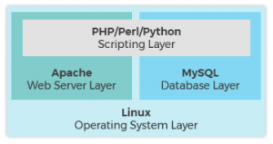

### In this project, I will implement a web solution based on LAMP stack on a Linux server by implementing the steps below:

# Step 1 — Installing Apache and Updating the Firewall
* We need to Install Apache using Ubuntu’s package manager, apt:
```
$ sudo apt update
$ sudo apt install apache2
```
* We need to adjust our firewall settings to allow HTTP traffic. UFW has different application profiles that we can leverage for accomplishing that. To list all currently available UFW application profiles, we can run:
```
$ sudo ufw app list
```
We’ll see output like this:
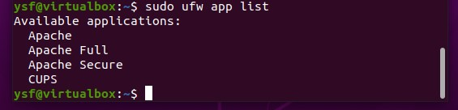
Here’s what each of these profiles mean:
* Apache: This profile opens only port 80 (normal, unencrypted web traffic).
* Apache Full: The profile opens port 80 (normal unencrypted web traffic) and port 443 (TLS/SSL encrypted traffic).
* Apache Secure: This profile opens only port 443 (TLS/SSL encrypted traffic).
#### For now, it’s best to allow only connections on port 80, since this is a new Apache installation and we still don’t have a TLS/SSL certificate configured to allow for HTTPS traffic on our server.
To only allow traffic on port 80, use the Apache profile:
```
$ sudo ufw enable

$ sudo ufw allow ssh

$ sudo ufw allow http
```
And we can verify the change with:
```
$ sudo ufw status
```
We’ll see output like this:
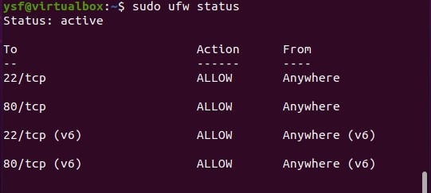
This shows that Traffic on port 80 is now allowed through the firewall.

### We can do a spot check right away to verify that everything went as planned by visiting your server’s public IP address in our web browser using *http://our_server_ip* or using our localhost *http://localhost*.
```
http://our_server_ip

http://localhost
```
We’ll see the default Ubuntu 20.04 Apache web page, which is there for informational and testing purposes. It should look something like this:
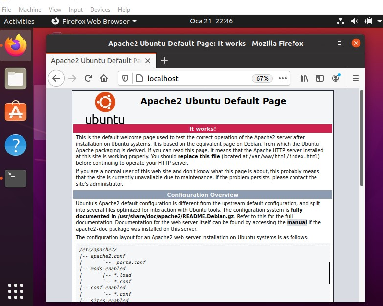

*If you see this page, then our web server is now correctly installed and accessible through our firewall.*

# Step 2 — Installing MySQL
### Now that our web server is up and running, We need to install the database system to be able to store and manage data for our website. MySQL is a popular database management system used within PHP environments.

* We need to Install mysql-server:
```
$ sudo apt -y install mysql-server
```
After the installation it’s recommended that we run a security script that comes pre-installed with MySQL. This script will remove some insecure default settings and lock down access to our database system. Start the interactive script by running:
```
$ sudo mysql_secure_installation
```
### This will ask if we want to configure the VALIDATE PASSWORD PLUGIN.
*Answer Y for yes, or anything else to continue without enabling.*
<p>We’ll see output like this:</p>

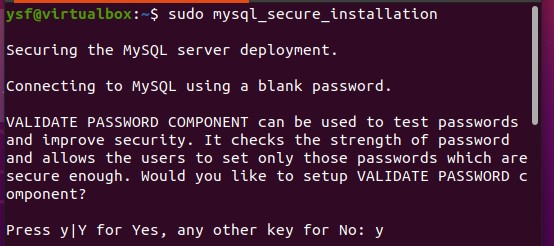

### If you answer “yes”, We will be asked to select a level of password validation. Keep in mind that if you enter 2 for the strongest level, you will receive errors when attempting to set any password which does not contain numbers, upper and lowercase letters, and special characters, or which is based on common dictionary words.

<p>We’ll see output like this:</p>

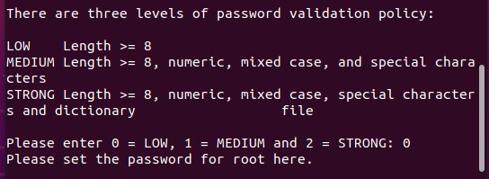

### <p> If we enabled password validation, we’ll be shown the password strength for the root password we just entered and our server will ask if we want to continue with that password. If we are happy with our current password, enter Y for “yes” at the prompt:</p>

<p>We’ll see output like this:</p>

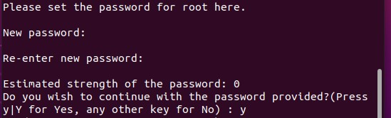

### For the rest of the questions, We press Y and hit the ENTER key at each prompt. This will remove some anonymous users and the test database, disable remote root logins, and load these new rules so that MySQL immediately respects the changes we have made.

* When you’re finished, test if you’re able to log in to the MySQL console by typing:
```
$ sudo mysql
```
### This will connect to the MySQL server as the administrative database user root, which is inferred by the use of sudo when running this command.
<p>We’ll see output like this:</p>

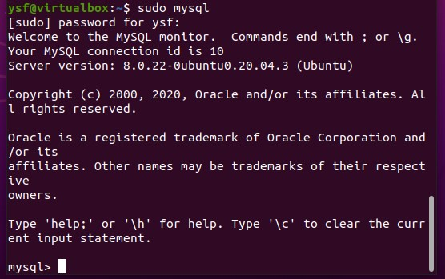

* To exit the MySQL console, type:
```
mysql> exit
```
### Setting a password for the root MySQL account works as a safeguard, in case the default authentication method is changed from unix_socket to password. For increased security, it’s best to have dedicated user accounts with less expansive privileges set up for every database, especially if we plan on having multiple databases hosted on our server.

### *Note*: At the time of this writing, the native MySQL PHP library mysqlnd doesn’t support caching_sha2_authentication, the default authentication method for MySQL 8. For that reason, when creating database users for PHP applications on MySQL 8, we’ll need to make sure they’re configured to use mysql_native_password instead. We’ll demonstrate how to do that later.

### Our MySQL server is now installed and secured. 

# Step 3 — Installing PHP
### We have Apache installed to serve our content and MySQL installed to store and manage our data. PHP is the component of our setup that will process code to display dynamic content to the final user. In addition to the php package, we’ll need php-mysql, a PHP module that allows PHP to communicate with MySQL-based databases. We’ll also need libapache2-mod-php to enable Apache to handle PHP files. Core PHP packages will automatically be installed as dependencies.

* To install these packages, run:
```
$ sudo apt -y install php libapache2-mod-php php-mysql
```
* Once the installation is finished, you can run the following command to confirm your PHP version:
```
$ php -v
```
<p>We’ll see output like this:</p>

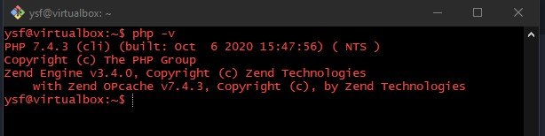

### At this point, our LAMP stack is fully operational, but before we can test our setup with a PHP script, it’s best to set up a proper Apache Virtual Host to hold our website’s files and folders. We’ll do that in the next step.

# Step 4 — Creating a Virtual Host for our Website using Apache

### When using the Apache web server, We can create virtual hosts to encapsulate configuration details and host more than one domain from a single server. In this project, we will set up a domain called *propitixhomes.local*, but we can replace this with any domain of your choice.

### Apache on Ubuntu 20.04 has one server block enabled by default that is configured to serve documents from the */var/www/html* directory. While this works well for a single site, it can become unwieldy if you are hosting multiple sites. Instead of modifying */var/www/html*, we’ll create a directory structure within */var/www* for the *propitixhomes.local* site, leaving */var/www/html* in place as the default directory to be served if a client request doesn’t match any other sites.

* Create the directory for *propitixhomes.local* as follows:
```
$ sudo mkdir /var/www/propitixhomes.local
```
We’ll see output like this in our */var/www* 

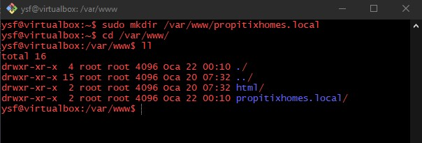

* Next, We need to assign ownership of the directory with the $USER environment variable, which will reference our current system user:
```
$ sudo chown -R ysf:ysf /var/www/propitixhomes.local
```
We’ll see output like this: 

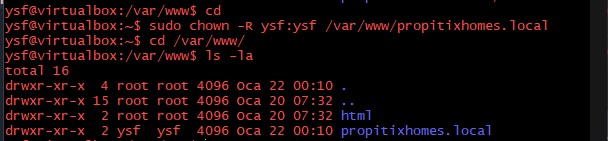

* We can now open a new configuration file in Apache’s sites-available directory using our preferred command-line editor. Here, we’ll be using nano:
```
$ sudo nano /etc/apache2/sites-available/propitixhomes.local.conf
```
* This will create a new blank file. Paste in the following configuration into the open nano text-editor:
```
<VirtualHost *:80>
    ServerName propitixhomes.local
    ServerAlias www.propitixhomes.local 
    ServerAdmin webmaster@localhost
    DocumentRoot /var/www/propitixhomes.local
    ErrorLog ${APACHE_LOG_DIR}/error.log
    CustomLog ${APACHE_LOG_DIR}/access.log combined
</VirtualHost>
```
We’ll see output like this: 

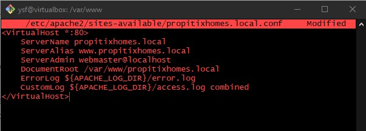

### To save and close the file, simply follow the steps below:
* Press CTRL O on the keyboard to write to the file
* Hit Enter to save the file.
* Press CTRL X on the keyboad to exit the editor 

#### You can use the *ls* command to show the new file in the sites-available directory
```
$ sudo ls /etc/apache2/sites-available
```
We’ll see output like this: 


### With this VirtualHost configuration, we’re telling Apache to serve propitixhomes.local using */var/www/propitixhomes.local* as the web root directory. If we like to test Apache without a domain name, we can remove or comment out the options ServerName and ServerAlias by adding a # character in the beginning of each option’s lines. Adding the # character there will tell the program to skip processing the instructions on those lines.

* We can now use a2ensite to enable the new virtual host:
```
$ sudo a2ensite propitixhomes.local
```
We’ll see output like this: 

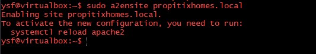

* We might want to disable the default website that comes installed with Apache. This is required if we are not using a custom domain name, because in this case Apache’s default configuration would overwrite our virtual host. To disable Apache’s default website, type:
```
$ sudo a2dissite 000-default
```
We’ll see output like this: 

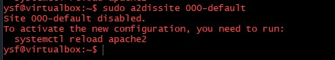
* To make sure our configuration file doesn’t contain syntax errors, run:
```
$ sudo apache2ctl configtest
```
We’ll see output like this: 

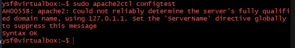

* Finally, reload Apache so these changes take effect:

```
$ sudo systemctl reload apache2
```
We’ll see output like this: 

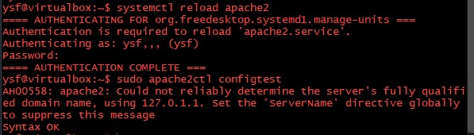

* Our new website is now active, but the web root */var/www/propitixhomes.local* is still empty. We need to create an *index.html* file in that location so that we can test that the virtual host works as expected:
```
$ nano /var/www/propitixhomes.local/index.html
```
* We can paste this into the editor
 ```
 <html>
<head>
<title>Apache2 Web Hosting </title>
<style type="text/css">
<!--
h1	{text-align:center;
	font-family:Arial, Helvetica, Sans-Serif;
	}

p	{text-indent:20px;
	}
-->
</style>
</head>
<body bgcolor = "#ffffcc" text = "#000000">
<h1>APACHE2 WEB TEST PAGE</h1>

<p>You can also use this page to test your Javascript functions and local style declarations. Everything you do will be handled entirely by your own browser; nothing you type into the text box will be sent back to the server.</p>

<p>When you are satisfied with your page, you can select all text in the text area and copy it to a new text file, with an extension of either *htm* or *html*, depending on your Operating System.</p>

</body>
</html>
```
* Now we can go to our browser and access our server’s domain name or IP address once again:
```
http://server_domain_or_IP
```
We’ll see output like this: 

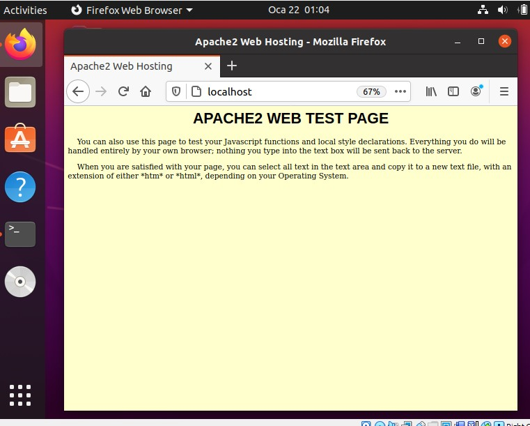

### If we see the text we wrote in the file, then it means our Apache virtual host is working as expected.

# A Note About DirectoryIndex on Apache
With the default DirectoryIndex settings on Apache, a file named index.html will always take precedence over an index.php file. This is useful for setting up maintenance pages in PHP applications, by creating a temporary index.html file containing an informative message to visitors. Because this page will take precedence over the index.php page, it will then become the landing page for the application. Once maintenance is over, the index.html is renamed or removed from the document root, bringing back the regular application page.

* In case we want to change this behavior, we will need to edit the */etc/apache2/mods-enabled/dir.conf* file and modify the order in which the *index.php* file is listed within the DirectoryIndex directive:
```
$ sudo nano /etc/apache2/mods-enabled/dir.conf
```
```
<IfModule mod_dir.c>
        DirectoryIndex index.html index.cgi index.pl index.php index.xht
</IfModule>
```
* After saving and closing the file, we will need to reload Apache so the changes take effect:
```
$ sudo systemctl reload apache2
```
### Now that we have a custom location to host our website’s files and folders, we’ll create a PHP test script to confirm that Apache is able to handle and process requests for PHP files.

* We create a new file named info.php inside our custom web root folder:
```
$ nano /var/www/propitixhomes.local/info.php
```
* This will open a blank file. Add the following text, which is valid PHP code, inside the file:
```php
<?php
phpinfo();
?>
```
We should see a page similar to this:

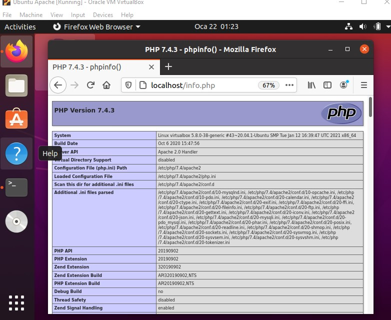


## Credits
https://www.ibm.com/cloud/learn/lamp-stack-explained

https://phoenixnap.com/kb/what-is-a-lamp-stack

https://www.youtube.com/watch?v=HUBNt18RFbo&feature=youtu.be

https://starter-pbl.darey.io/en/latest/project1.html